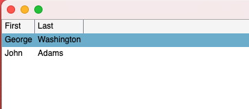

# Avalonia nac.Forms.Table

## Control Examples
+ Simple Table
```c#
  var f = Avalonia.AppBuilder.Configure<App>()
    .NewForm();

  var people = new ObservableCollection<model.Person>
  {
    new model.Person
    {
      First = "George",
      Last = "Washington"
    },
    new model.Person
    {
      First = "John",
      Last = "Adams"
    }
  };
  f.Model["persons"] = people;

  f.Table<model.Person>("persons")
    .Display();
```
+ Result
    + 